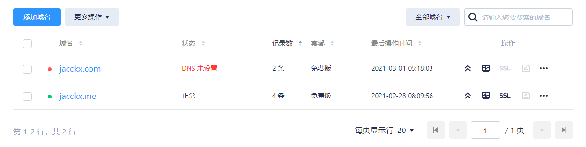
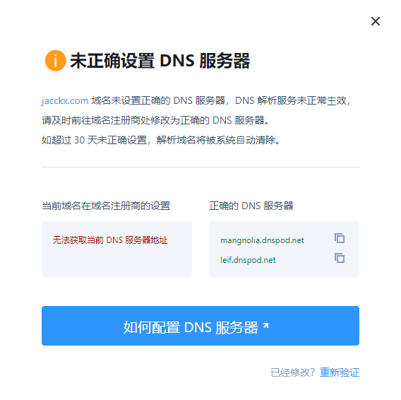
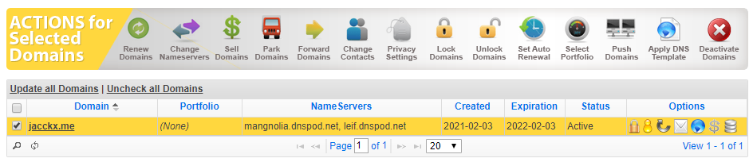
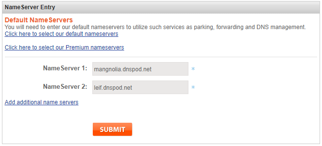
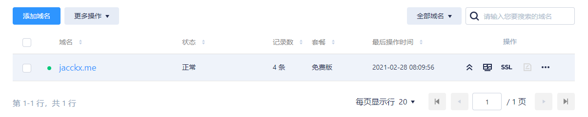
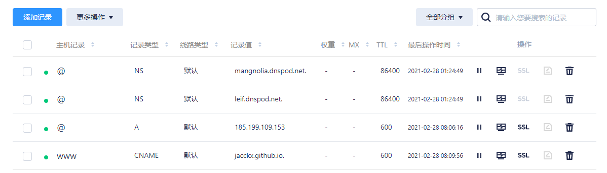
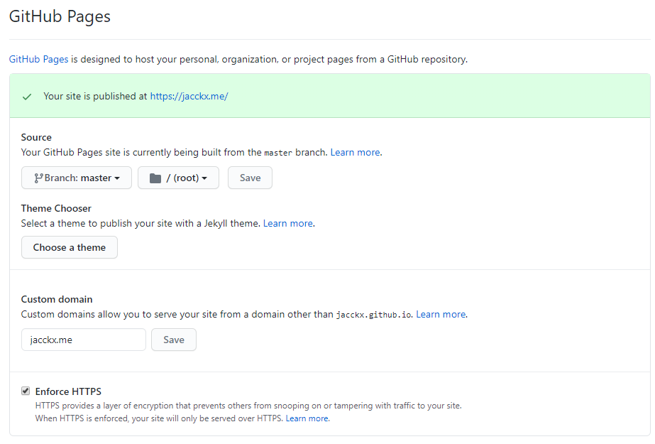
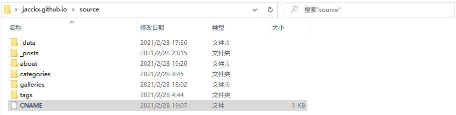
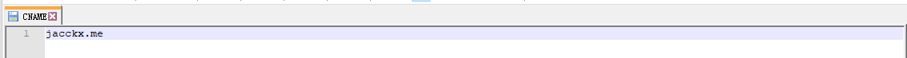

在GitHub上部署Hexo博客后，其博客默认域名为`example.github.io`。如果对默认的域名不满意，可以绑定成个人拥有的域名。

## 购买域名

本站使用的域名为`Namesilo`平台下的购买的。因网上已存在丰富购买教学流程，例如：[Namesilo域名购买教程](https://medium.com/@jackme256/namesilo-guide-2b7859157556)，所以本文重点将放在绑定个人域名的过程上。

## 修改DNS

Namesilo域名的默认DNS为境外的服务器，其解析生效时间比其他第三方要更慢。这里推荐使用国内DNSPOD的解析服务。


步骤：

1. 注册一个DNSPOD的账户，实名认证后在管理控制台下的DNS解析里`添加`你购买的域名。如下图里添加了一个新的域名jacck.com

   

   

3. 添加域名后，点击"DNS未设置"。在弹出的窗口中复制右侧的正确的DNS服务器，后面需要在Namesilo里设置。如下图所示：

   

   

4. 复制正确的DNS服务器后，前往Namesilo域名管理页面，勾选你的域名，点击【Change Nameservers】图标。如下图所示：

   

   

5. 进入新页面后，将表格里默认的三条地址删除，然后黏贴DNSPOD里复制的两条信息，然后点击【Submit】。如下图所示：

   

   

6. 更改DNS后，一般需要等待0-72个小时才会生效。博主当初等了24小时。


## 解析域名

1. 修改完DNS后回到DNSPOD，然后刷新你的域名状态，则会显示为【正常】，如下图所示：

   

   

2. 然后点击你的域名，在【记录管理】页面下，添加两条新的解析记录，如下图中第三和第四行所示：

   

   

3. `A记录类型`的记录值为你的GitHub博客的IP地址（如何获得博客地址请看下面相关问题部分），`CNAME记录类型`的记录值为你的GitHub博客域名。同时添加两条记录可以确保在访问网页时，无论是否添加www都可以访问到。


## GitHub设置

1. 进入你的博客仓库，点击【Settings】，在GitHub Pages下设置你的Custom domain为你个人的域名，然后保存。如下图所示：

   

   

2. 保存后，会自动的在你的master下会生成一个名为CNAME的文件。但是需要注意的是，每次部署后此文件都会消失，解决这个问题的办法就是在本地的博客目录里的source文件夹下，创建一个名为CNAME的文件，写入域名信息。如下图所示：

   

   

   

3. 这里写入的域名加不加www都可以，从网上已有的经验看：

   > 如果不加www，那么无论是访问`http://www.jacckx.me`还是`http://jacckx.me`，都会自动跳转到 `http://jacckx.me`
   >
   > 
   >
   > 如果加上www，那么无论是访问`http://www.jacckx.me`还是`http://jacckx.me`，都会自动跳转到`http://www.jacckx.me`
   >
   > 
   >
   > 如果填写的是其它子域名，如`abc.jacckx.me`，那么访问`http://abc.jacckx.me`没问题，但是访问`http://jacckx.me`，不会自动跳转到`http://abc.jacckx.me`

   

4. 保存文件后，在Git Bash中，依次输入以下命令：

   ```shell
   hexo clean // 清理旧的博客
   hexo g // 重新生成博客
   hexo d // 部署博客到GitHub
   ```

5. 至此，你的博客已经绑定到你的个人域名上，这时只要等待DNS解析生效，大概0-72个小时，即可正常访问你的博客。以下的【相关问题】可能会解决你的一些疑惑。

## 相关问题

### Q1：如何获得GitHub博客的IP地址？

- 打开Git Bash或者cmd控制台，输入：

- ```shell
  ping example.github.io
  ```

- 返回的结果为你的博客IP地址。

### Q2：绑定个人域名后原有的GitHub域名还能用吗？

- 原来的example.github.io域名依旧可以使用，访问时会自动跳转至已绑定的个人域名。

### Q3：域名解析不生效怎么办？

1. 因解析在全球生效时间是一定的延迟，所以在Namesilo更改DNS服务器后，一般是需要等待0-72个小时才能生效。
2. 确认是否配置好相关的解析记录，如常用的 A 记录、CNAME 记录等，否则，解析无法生效。

### Q4：如何测试解析是否生效？

- 执行Q1的`ping`命令，如果返回结果显示ip，则表明解析已经生效。

### Q5：域名解析已经生效，为什么还是无法打开网站？

1. 浏览器问题：清除浏览器的缓存记录再次尝试访问。
2. 本机电脑DNS缓存问题：在cmd里执行`ipconfig /flushdns`命令，来刷新本机电脑的DNS缓存。

