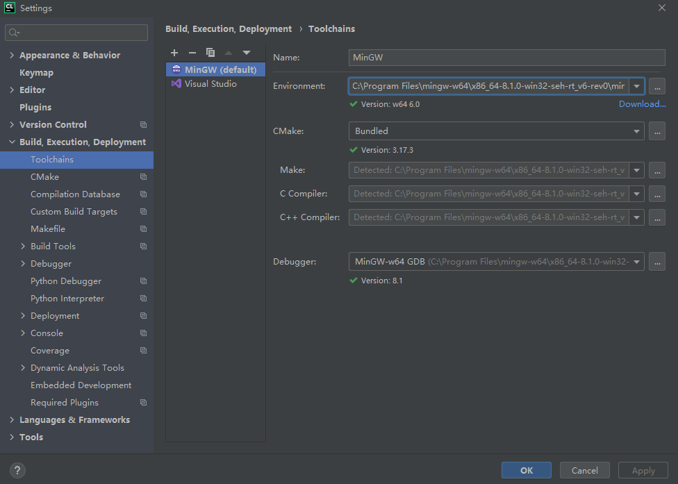
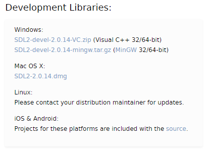
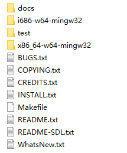
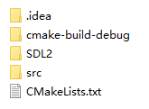
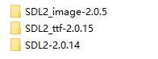

SDL（Simple DirectMedia Layer）是一套开发源代码的跨平台多媒体开发库，使用C语言编写。SDL提供了多种控制图像，声音，输出入等等接口供开发者使用。目前SDL多用于游戏开发、模拟器、媒体播放器等多媒体应用领域。博主正好大二的C++课程需要用到SDL2来开发一款小游戏。

那这篇博客就简单记录下我在Window系统下，使用CLion配置SDL2开发环境的过程。


开发环境：

- 系统：Windows 10
- IDE：CLion
- 编译器：MinGW 
- 开发库：SDL2

## 下载配置环境

官方下载MinGW：http://mingw-w64.org/doku.php/download/mingw-builds

点击`Sourceforge`跳转到新页面后等待五秒钟就会开始下载安装程序。

安装后，打开CLion里的Settings -> Build,Execution,Deployment -> Toolchains 里配置一下MinGW编译器，正常只要安装完MinGW后CLion会自动帮你配置好，如下图所示：




官方下载SDL2：https://www.libsdl.org/download-2.0.php

我使用了CLion来开发，这里选择下载最新的MinGW开发库，如果使用Visual Studio开发的话，选择下载VC开发库。如下图所示：




下载下来解压后，文件的结构应该如下图所示：



主要包含使用说明、doc文档，以及库文件。这里的库文件包含i686和x86_64两种架构，每一种都包含了头文件和动态链接库。因为我们先前安装的是x86_64架构的MinGW，所以之后我们会选择使用x86_64的库文件。

> 说明一下：
>
> .dll后缀的为动态库
>
> .lib后缀的为静态库
>


在构建完项目后，在项目目录创建一个SDL2文件夹，用来存放使用到的库。如下图所示：



博主的项目不仅仅使用到了SDL2主体的库，还是用到了其衍生的SDL2_image以及SDL2_ttf的库，我把他们归纳到SDL2文件夹里，如下图所示：




一切准备好后现在要开始关联SDL2开发库了。SDL说白了就是一个C语言库，因此配置就和其他库一样，只需要在项目的CMakeLists里配置如下命令就行了：


> ```cmake
> cmake_minimum_required(VERSION 3.17)
> project(CPP_cw)
> 
> set(CMAKE_CXX_STANDARD 14)
> 
> set(SOURCE_FILES src/BaseEngine.cpp)
> 
> # 声明一个变量为SDL2_DIR包含所有头文件的路径
> set(SDL2_DIR
>         SDL2/SDL2-2.0.14/x86_64-w64-mingw32/include/SDL2
>         SDL2/SDL2_image-2.0.5/x86_64-w64-mingw32/include/SDL2
>         SDL2/SDL2_ttf-2.0.15/x86_64-w64-mingw32/include/SDL2)
>         
> # 声明一个变量为SDL2_LINK包含所有库的路径
> set(SDL2_LINK
>         SDL2/SDL2-2.0.14/x86_64-w64-mingw32/bin
>         SDL2/SDL2_image-2.0.5/x86_64-w64-mingw32/bin
>         SDL2/SDL2_ttf-2.0.15/x86_64-w64-mingw32/bin)
> 
> # 关联所有的头文件
> include_directories(${SDL2_DIR})
> # 关联所有的库
> link_directories(${SDL2_LINK})
> 
> add_executable(CPP_cw ${SOURCE_FILES})
> 
> # 配置关联库的名称，如果只使用到SDL2主体的库，那只需要添加mingw32 SDL2 SDL2main
> target_link_libraries(CPP_cw mingw32 SDL2 SDL2main SDL2_ttf SDL2_image)
> ```
>
> 
>


只在CMakeLists里关联了库还不能正常运行项目，还需要将所有库中的bin,include,lib,share文件夹复制并粘贴到之前安装的MinGW的对应目录中。这样，项目就能正常运行了。

